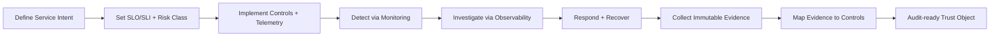
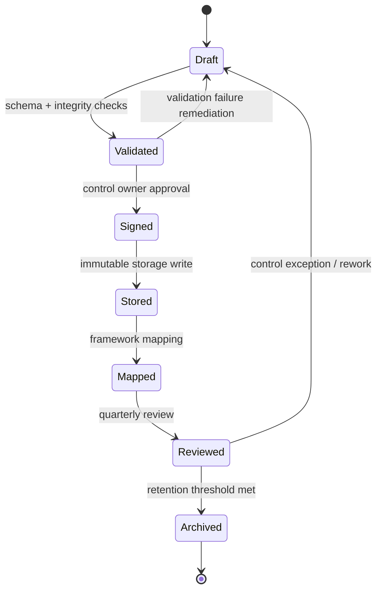

# Intent-to-Auditable-Trust-Object (IATO)

A practical framework for turning operational intent into audit-ready trust evidence across reliability, security, and compliance domains.

## Table of Contents

- [Intent-to-Auditable-Trust-Object (IATO)](#intent-to-auditable-trust-object-iato)
  - [Table of Contents](#table-of-contents)
  - [1) Purpose and Audience](#1-purpose-and-audience)
  - [2) Eligibility Structure](#2-eligibility-structure)
    - [2.1 Eligibility Tiers](#21-eligibility-tiers)
    - [2.2 Entry and Exit Criteria](#22-entry-and-exit-criteria)
  - [3) SRE Operating Model](#3-sre-operating-model)
    - [3.1 Reliability and Security Workflow](#31-reliability-and-security-workflow)
    - [3.2 Packet Lifecycle (Mermaid)](#32-packet-lifecycle-mermaid)
    - [3.3 Control Loop Responsibilities](#33-control-loop-responsibilities)
  - [4) Control Mapping (SOC 2 + ASVS + Essential Eight)](#4-control-mapping-soc-2--asvs--essential-eight)
    - [4.1 Technical Control Mapping Table](#41-technical-control-mapping-table)
    - [4.2 Coverage Graph (Table View)](#42-coverage-graph-table-view)
  - [5) Evidence Model (Maintainable by Default)](#5-evidence-model-maintainable-by-default)
    - [5.1 Evidence Design Principles](#51-evidence-design-principles)
    - [5.2 Evidence Record Schema (Minimal)](#52-evidence-record-schema-minimal)
    - [5.3 CRUD Operations via IDE (VS Code / IntelliJ)](#53-crud-operations-via-ide-vs-code--intellij)
  - [6) Repository Layout](#6-repository-layout)
  - [7) Deployment and Local Validation](#7-deployment-and-local-validation)
    - [7.1 Local Stack Setup (`nginx -> apache -> drupal -> mariadb`)](#71-local-stack-setup-nginx---apache---drupal---mariadb)
    - [7.2 Optional Observability Stack](#72-optional-observability-stack)
    - [7.3 Elastic Beanstalk Deployment Workflow](#73-elastic-beanstalk-deployment-workflow)
  - [8) Control Reference Legend](#8-control-reference-legend)
  - [9) Drupal Reverse-Proxy Stack (Nginx + Apache + Drupal + MariaDB)](#9-drupal-reverse-proxy-stack-nginx--apache--drupal--mariadb)
    - [9.1 Run the Stack](#91-run-the-stack)
    - [9.2 S3-backed Drupal Uploads (`sites/default/files`)](#92-s3-backed-drupal-uploads-sitesdefaultfiles)
    - [9.3 Conda Lock from `pyproject.toml`](#93-conda-lock-from-pyprojecttoml)
  - [10) Cyber Risk Management Controls Document](#10-cyber-risk-management-controls-document)

---

## 1) Purpose and Audience

This README is structured for:
- **SRE teams** operating reliability and incident response workflows.
- **Security and GRC teams** mapping implementation evidence to compliance controls.
- **Platform teams** building repeatable, policy-driven pipelines.

Outcome: a clear eligibility structure, operating model, and control mapping to **SOC 2**, **OWASP ASVS**, and **Essential Eight**.

Quick jump: [Eligibility Structure](#2-eligibility-structure), [SRE Operating Model](#3-sre-operating-model), [Evidence Model](#5-evidence-model-maintainable-by-default).

---

## 2) Eligibility Structure

A system or service is eligible for IATO onboarding only when all P0 requirements are met.

### 2.1 Eligibility Tiers

| Tier | Description | Mandatory Artifacts | Control References |
|---|---|---|---|
| **P0 - Foundational** | Minimum bar for production onboarding. | Service inventory, owner, data classification, runbook, logs/metrics/traces, IAM roles, backup policy. | SOC 2 **CC1.2**, **CC6.1**, **CC7.2**; ASVS **V1**, **V7**, **V10**; Essential Eight **Patch**, **MFA**, **Backups** |
| **P1 - Assured** | Adds measurable reliability and security posture. | SLO/SLI definitions, alert routing, key rotation records, vulnerability remediation SLA, immutable audit logs. | SOC 2 **CC6.6**, **CC7.1**, **CC7.3**; ASVS **V2**, **V9**, **V14**; Essential Eight **Privileged Access**, **Application Control** |
| **P2 - Continuous Audit** | Continuous evidence generation and governance. | Automated evidence export, quarterly access recertification, control exception workflow, control effectiveness review. | SOC 2 **CC3.2**, **CC4.1**, **CC8.1**; ASVS **V1.14**, **V13**; Essential Eight **User Application Hardening**, **Restrict Admin Privileges** |

### 2.2 Entry and Exit Criteria

| Stage | Entry Criteria | Exit Criteria | Evidence Output |
|---|---|---|---|
| **Intake** | Service owner assigned, criticality rated, trust boundary documented. | Control owner approved and service registered in inventory. | Service profile + boundary record |
| **Implementation** | P0 artifacts complete. | Telemetry and IAM controls validated by CI checks. | Control test logs + validation report |
| **Operationalization** | Alerting and runbooks are active. | Two successful incident simulations completed. | Incident timeline + corrective actions |
| **Audit-ready** | Evidence pipeline enabled. | Control-to-evidence map exported and signed-off. | Audit packet + change history |

Continue to [SRE Operating Model](#3-sre-operating-model) to see how these stages run as a loop.

---

## 3) SRE Operating Model

### 3.1 Reliability and Security Workflow



### 3.2 Packet Lifecycle (Mermaid)



### 3.3 Control Loop Responsibilities

| Function | SRE | Security | Platform | GRC |
|---|---|---|---|---|
| Service reliability objectives | **A/R** | C | C | I |
| IAM and secrets controls | C | **A/R** | R | I |
| Telemetry instrumentation | **A/R** | C | R | I |
| Incident response execution | **A/R** | R | C | I |
| Compliance evidence mapping | C | R | C | **A/R** |

(A = Accountable, R = Responsible, C = Consulted, I = Informed)

---

## 4) Control Mapping (SOC 2 + ASVS + Essential Eight)

### 4.1 Technical Control Mapping Table

| IATO Control Domain | Implementation Expectation | SOC 2 Ref | ASVS Ref | Essential Eight Ref | Primary Evidence |
|---|---|---|---|---|---|
| **Identity & Access Management** | RBAC, least privilege, JML lifecycle, MFA, break-glass auditing | [SOC2:CC6.1], [SOC2:CC6.2], [SOC2:CC6.3] | [ASVS:V2], [ASVS:V3] | [E8:MFA], [E8:RestrictAdmin] | Access reviews, auth logs, privilege change tickets |
| **Secure Configuration & Hardening** | Baseline hardened images, configuration drift checks, change approvals | [SOC2:CC5.2], [SOC2:CC8.1] | [ASVS:V1], [ASVS:V14] | [E8:AppControl], [E8:UserAppHardening] | Image attestations, IaC scan results, approval records |
| **Vulnerability & Patch Management** | Risk-ranked remediation SLAs and emergency patch path | [SOC2:CC7.1], [SOC2:CC7.2] | [ASVS:V1.2], [ASVS:V14.2] | [E8:PatchApps], [E8:PatchOS] | CVE backlog age, patch deployment logs |
| **Observability & Detection** | Unified logs/metrics/traces, alert thresholds, anomaly detection | [SOC2:CC7.2], [SOC2:CC7.3] | [ASVS:V7], [ASVS:V10] | [E8:Monitoring] | Alert histories, traces, SIEM exports |
| **Incident Response & Recovery** | Severity matrix, runbooks, recovery tests, postmortems | [SOC2:CC7.4], [SOC2:CC7.5] | [ASVS:V1.14], [ASVS:V10.3] | [E8:Backups] | Incident timeline, RTO/RPO tests, PIR records |
| **Auditability & Evidence Integrity** | Tamper-evident logs, retention policy, signed evidence bundles | [SOC2:CC3.2], [SOC2:CC4.1] | [ASVS:V1.1], [ASVS:V13] | [E8:Governance] | Hash manifests, retention policies, audit packets |

### 4.2 Coverage Graph (Table View)

| Domain \ Framework | SOC 2 | ASVS | Essential Eight |
|---|---:|---:|---:|
| IAM | High | High | High |
| Hardening | Medium | High | High |
| Patch/Vulnerability | High | Medium | High |
| Observability/Detection | High | Medium | Medium |
| Incident/Recovery | High | Medium | High |
| Evidence/Governance | High | Medium | Medium |

Interpretation: **High** = explicit mandatory controls in onboarding tiers; **Medium** = required but may be risk-adjusted by service criticality.

---

## 5) Evidence Model (Maintainable by Default)

### 5.1 Evidence Design Principles

- Keep evidence generation **automated** and attached to delivery pipelines.
- Store evidence with immutable timestamps and hash integrity metadata.
- Use a single control identifier format across teams (`CTRL-<DOMAIN>-<ID>`).
- Link every exception to an owner, expiry date, and compensating control.

### 5.2 Evidence Record Schema (Minimal)

| Field | Required | Example |
|---|---|---|
| `control_id` | Yes | `CTRL-IAM-006` |
| `service` | Yes | `payments-api` |
| `environment` | Yes | `prod` |
| `timestamp_utc` | Yes | `2026-02-15T02:30:00Z` |
| `source` | Yes | `ci/tools/run_all_checks.sh` |
| `artifact_uri` | Yes | `s3://audit-bucket/evidence/...` |
| `hash_sha256` | Yes | `<digest>` |
| `mapped_controls` | Yes | `SOC2:CC6.1, ASVS:V2, E8:MFA` |
| `approver` | Conditional | `security-oncall` |
| `exception_id` | Conditional | `EXC-2026-0042` |

### 5.3 CRUD Operations via IDE (VS Code / IntelliJ)

This section outlines how to perform CRUD operations using an IDE database tool (for example, VS Code or IntelliJ).

**Prerequisites**
- Installed IDE with database extension/plugin enabled.
- Configured database connection (host, port, credentials, and schema access).

**CRUD Operations via IDE**
- **Create**: Open Database Explorer, right-click the `Users` table, then select **Insert Row**.
- **Read**: Run `SELECT * FROM Users;` in the integrated query tool.
- **Update**: Run `UPDATE Users SET status = 'active' WHERE id = 1;`.
- **Delete**: Run `DELETE FROM Users WHERE id = 1;`.

Screenshot of IDE CRUD operation: _Add screenshot here._

---

## 6) Repository Layout

High-signal directories only:

- `docker/` — local container and observability stack assets.
- `ci/` — CI checks and environment validation tooling.
- `infrastructure/` — environment and provisioning assets.
- `changelog/` — release history and changelog materials.
- `bin/scripts/` — legacy shell/python helper files.
- `bin/docs/` — archival notes and process documentation.
- `bin/web-assets/` — static dependency visualization assets.
- `tests/` — deployment-grade automated test suites (Python and C#).
- `docs/notebooks/` — executable notebook documentation (`.ipynb`) for workflows and validation.

Pinned root configuration files:

- `.dockerignore` — controls Docker build context size and excludes local cache/artifact files.
- `.env.example` — baseline environment variables for local Docker stack startup.
- `Dockerfile` — base PHP-FPM image definition used for repository containerization workflows.
- `docker-compose.yml` — canonical local multi-service stack (`nginx`, `apache`, `drupal`, `db`).
- `pyproject.toml` — Python project metadata and conda-lock dependency configuration.

---

## 7) Deployment and Local Validation

### 7.1 Local Stack Setup (`nginx -> apache -> drupal -> mariadb`)

1. Copy environment defaults:
   - `cp .env.example .env`
2. Start the stack:
   - `docker compose up -d --build`
3. Check health:
   - `curl -fsS http://localhost:8080/healthz`
4. Stop and remove resources:
   - `docker compose down -v`

### 7.2 Optional Observability Stack

```bash
docker compose -f docker/compose/php-observability-stack.yml up --build
```

### 7.3 Elastic Beanstalk Deployment Workflow

1. Install and configure EB CLI (`pip install awsebcli`, `aws configure`).
2. Initialize the app: `eb init`.
3. Create/update environment: `eb create` or `eb deploy`.

`eb deploy` packages the repository (including `docker-compose.yml`) and uploads the bundle to S3 before deployment.

---

## 8) Control Reference Legend

- **SOC 2** references use `SOC2:<criterion>` (e.g., `SOC2:CC6.1`).
- **ASVS** references use `ASVS:<section>` (e.g., `ASVS:V2`).
- **Essential Eight** references use `E8:<control>` (e.g., `E8:MFA`).

> Note: final control interpretation remains organization-specific and should be validated by internal compliance/legal stakeholders.

---

## 9) Drupal Reverse-Proxy Stack (Nginx + Apache + Drupal + MariaDB)

This repository includes a 4-service web stack:

- `nginx` (edge entrypoint)
- `apache` (internal reverse proxy)
- `drupal` (Drupal runtime)
- `db` (MariaDB persistence)

`docker-compose.yml` runs four services: `nginx`, `apache`, `drupal`, and `db` (MariaDB).

- Request flow: `client -> nginx:80 -> apache:8080 -> drupal:80`
- Data persistence:
  - `db_data` named volume for MariaDB data
  - `drupal_files` named volume for `sites/default/files` when S3 is not configured

### 9.1 Run the Stack

```bash
cp .env.example .env
docker compose up -d --build
```

Open Drupal at `http://localhost:8080`.

### 9.2 S3-backed Drupal Uploads (`sites/default/files`)

The Drupal image mounts S3 with `s3fs` and maps only `/var/www/html/sites/default/files` to S3.

Required environment variables:

- `S3_BUCKET`
- `AWS_REGION`
- Optional `S3_PREFIX` (defaults to `sites/default/files`)
- Either AWS access keys (`AWS_ACCESS_KEY_ID`/`AWS_SECRET_ACCESS_KEY`) or IAM role credentials

### 9.3 Conda Lock from `pyproject.toml`

Dependency definitions live in `pyproject.toml` with `tool.conda-lock` settings.

```bash
conda-lock lock --file pyproject.toml
conda-lock install --name iato-dev conda-lock.yml
```

### 9.4 IAM Parser + REST Log Automation (`Makefile`)

Use the root `Makefile` to parse an IAM policy and POST the JSON result to your API endpoint.

```bash
# from environment or .env
export TARGET_POLICY=path/to/policy.json
export LOG_ENDPOINT=https://<your-api-endpoint>/risk-results
export API_KEY=<bearer-token>

make parse-iam
```

The `parse-iam` target validates required variables, runs `iato_ops/iam_policy_parser.py`, writes `result.json`, then posts it to `LOG_ENDPOINT` with `Authorization: Bearer <API_KEY>`.

---

## 10) Cyber Risk Management Controls Document

The repository cyber risk management controls document is available at:

- [`docs/cyber-risk-controls.md`](docs/cyber-risk-controls.md)

Also see [Control Mapping](#4-control-mapping-soc-2--asvs--essential-eight) and [Evidence Model](#5-evidence-model-maintainable-by-default) for implementation context.

---

# Auditable Trust Object: 

This repository now includes a complete Docker Compose environment that couples a private Drupal app stack with an Enclave-secured monitoring plane.

## Architecture Overview

- **Enclave Core** (`enclave_agent`) provides overlay connectivity and secure naming (for example `grafana.enclave` and `drupal.enclave`).
- **Host-visibility sidecar** (`node-exporter`) runs in the Enclave network namespace and reads host `/proc` and `/sys` for auditable host metrics.
- **Monitoring plane** (`prometheus` + `grafana`) runs behind Enclave networking and scrapes `localhost:9100` from Node Exporter.
- **Gateway plane** (`nginx`) terminates TLS on port `443` and routes:
  - `https://grafana.enclave` → Grafana (`grafana:3000`)
  - `https://drupal.enclave` → Drupal via Apache (`apache:8080`)
- **Private app stack** (`drupal`, `apache`, `mariadb`) is isolated on `app_net` and not directly exposed to the host.

## Files Included

- `docker-compose.yml`
- `prometheus.yml`
- `nginx.conf`

## Quick Start (WSL2)

1. **Prerequisites**
   - Docker Desktop with WSL2 integration enabled.
   - A valid Enclave enrolment key.

2. **Prepare environment file**

   ```bash
   cp .env.example .env
   ```

   Edit `.env` and set:
   - `ENCLAVE_ENROLMENT_KEY`
   - `DRUPAL_DB_PASSWORD`
   - `MARIADB_ROOT_PASSWORD`
   - `GRAFANA_ADMIN_PASSWORD`

3. **Create TLS certificate for the Enclave Gateway**

   ```bash
   mkdir -p certs
   openssl req -x509 -nodes -newkey rsa:2048 -days 365 \
     -keyout certs/tls.key \
     -out certs/tls.crt \
     -subj "/CN=grafana.enclave"
   ```

4. **Start the full stack**

   ```bash
   docker compose up -d --build
   ```

## Verification Steps

### 1) Verify Enclave enrolment

```bash
docker logs enclave_agent
```

Look for successful enrolment and overlay connectivity messages.

### 2) Verify monitoring endpoints inside Enclave namespace

```bash
docker exec enclave_agent wget -qO- http://localhost:9100/metrics | head
```

```bash
docker exec enclave_agent wget -qO- http://localhost:9090/-/ready
```

### 3) Verify browser access through Enclave DNS

Open:

- `https://grafana.enclave`

(accept the self-signed certificate warning unless you provision a trusted cert).

### 4) Verify the Trust Object using Node Exporter dashboard

On first Grafana login:

1. Sign in with `GRAFANA_ADMIN_USER` / `GRAFANA_ADMIN_PASSWORD`.
2. Confirm the **Prometheus** datasource is already provisioned at `http://localhost:9090`.
3. Open the pre-provisioned **Node Exporter Full** dashboard.
4. Confirm host-level panels (CPU, memory, filesystem, load) are populated.

If panels populate immediately after startup, your auditable host telemetry path is active:

**Host kernel metrics → Node Exporter sidecar → Prometheus scrape → Grafana dashboard (Trust Object evidence surface).**

## Stop and cleanup

```bash
docker compose down -v
```


