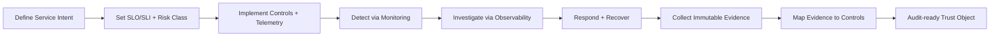

# Intent-to-Auditable-Trust-Object (IATO)


---

## 1) Purpose-Audience

This README is structured for:
- **SRE teams** operating reliability and incident response workflows.
- **Security and GRC teams** mapping implementation evidence to compliance controls.
- **Platform teams** building repeatable, policy-driven pipelines.

Outcome: a clear eligibility structure, operating model, and control mapping to **SOC 2**, **OWASP ASVS**, and **Essential Eight**.

---

## 2) Eligibility-Structure 

A system or service is eligible for IATO onboarding only when all P0 requirements are met.

### 2.1 Eligibility tiers

| Tier | Description | Mandatory Artifacts | Control References |
|---|---|---|---|
| **P0 - Foundational** | Minimum bar for production onboarding. | Service inventory, owner, data classification, runbook, logs/metrics/traces, IAM roles, backup policy. | SOC 2 **CC1.2**, **CC6.1**, **CC7.2**; ASVS **V1**, **V7**, **V10**; Essential Eight **Patch**, **MFA**, **Backups** |
| **P1 - Assured** | Adds measurable reliability and security posture. | SLO/SLI definitions, alert routing, key rotation records, vulnerability remediation SLA, immutable audit logs. | SOC 2 **CC6.6**, **CC7.1**, **CC7.3**; ASVS **V2**, **V9**, **V14**; Essential Eight **Privileged Access**, **Application Control** |
| **P2 - Continuous Audit** | Continuous evidence generation and governance. | Automated evidence export, quarterly access recertification, control exception workflow, control effectiveness review. | SOC 2 **CC3.2**, **CC4.1**, **CC8.1**; ASVS **V1.14**, **V13**; Essential Eight **User Application Hardening**, **Restrict Admin Privileges** |

### 2.2 Entry-exit-criteria

| Stage | Entry Criteria | Exit Criteria | Evidence Output |
|---|---|---|---|
| **Intake** | Service owner assigned, criticality rated, trust boundary documented. | Control owner approved and service registered in inventory. | Service profile + boundary record |
| **Implementation** | P0 artifacts complete. | Telemetry and IAM controls validated by CI checks. | Control test logs + validation report |
| **Operationalization** | Alerting and runbooks active. | Two successful incident simulations completed. | Incident timeline + corrective actions |
| **Audit-ready** | Evidence pipeline enabled. | Control-to-evidence map exported and signed-off. | Audit packet + change history |

---

## 3) SRE-Operating-Model

### 3.1 Reliability + security-workflow



### 3.2 Control-loop-responsibilities

| Function | SRE | Security | Platform | GRC |
|---|---|---|---|---|
| Service reliability objectives | **A/R** | C | C | I |
| IAM and secrets controls | C | **A/R** | R | I |
| Telemetry instrumentation | **A/R** | C | R | I |
| Incident response execution | **A/R** | R | C | I |
| Compliance evidence mapping | C | R | C | **A/R** |

(A = Accountable, R = Responsible, C = Consulted, I = Informed)

---

## 4) Control-Mapping (SOC 2 + ASVS + Essential Eight)

### 4.1 Technical control mapping table

| IATO Control Domain | Implementation Expectation | SOC 2 Ref | ASVS Ref | Essential Eight Ref | Primary Evidence |
|---|---|---|---|---|---|
| **Identity & Access Management** | RBAC, least privilege, JML lifecycle, MFA, break-glass auditing | [SOC2:CC6.1], [SOC2:CC6.2], [SOC2:CC6.3] | [ASVS:V2], [ASVS:V3] | [E8:MFA], [E8:RestrictAdmin] | Access reviews, auth logs, privilege change tickets |
| **Secure Configuration & Hardening** | Baseline hardened images, configuration drift checks, change approvals | [SOC2:CC5.2], [SOC2:CC8.1] | [ASVS:V1], [ASVS:V14] | [E8:AppControl], [E8:UserAppHardening] | Golden image digests, config scan reports |
| **Vulnerability & Patch Management** | Risk-ranked remediation SLAs and emergency patch path | [SOC2:CC7.1], [SOC2:CC7.2] | [ASVS:V1.2], [ASVS:V14.2] | [E8:PatchApps], [E8:PatchOS] | CVE backlog age, patch deployment logs |
| **Observability & Detection** | Unified logs/metrics/traces, alert thresholds, anomaly detection | [SOC2:CC7.2], [SOC2:CC7.3] | [ASVS:V7], [ASVS:V10] | [E8:Monitoring] | Alert histories, traces, SIEM exports |
| **Incident Response & Recovery** | Severity matrix, runbooks, recovery tests, postmortems | [SOC2:CC7.4], [SOC2:CC7.5] | [ASVS:V1.14], [ASVS:V10.3] | [E8:Backups] | Incident timeline, RTO/RPO tests, PIR records |
| **Auditability & Evidence Integrity** | Tamper-evident logs, retention policy, signed evidence bundles | [SOC2:CC3.2], [SOC2:CC4.1] | [ASVS:V1.1], [ASVS:V13] | [E8:Governance] | Hash manifests, retention policies, audit packets |

### 4.2 Coverage graph (table view)

| Domain \ Framework | SOC 2 | ASVS | Essential Eight |
|---|---:|---:|---:|
| IAM | High | High | High |
| Hardening | Medium | High | High |
| Patch/Vulnerability | High | Medium | High |
| Observability/Detection | High | Medium | Medium |
| Incident/Recovery | High | Medium | High |
| Evidence/Governance | High | Medium | Medium |

Interpretation: **High** = explicit mandatory controls in onboarding tiers; **Medium** = required but may be risk-adjusted by service criticality.

---

## 5) Evidence Model (Maintainable by default)

### 5.1 Evidence design principles
- Keep evidence generation **automated** and attached to delivery pipelines.
- Store evidence with immutable timestamps and hash integrity metadata.
- Use a single control identifier format across teams (`CTRL-<DOMAIN>-<ID>`).
- Link every exception to an owner, expiry date, and compensating control.

### 5.2 Evidence record schema (minimal)

| Field | Required | Example |
|---|---|---|
| `control_id` | Yes | `CTRL-IAM-006` |
| `service` | Yes | `payments-api` |
| `environment` | Yes | `prod` |
| `timestamp_utc` | Yes | `2026-02-15T02:30:00Z` |
| `source` | Yes | `ci/tools/run_all_checks.sh` |
| `artifact_uri` | Yes | `s3://audit-bucket/evidence/...` |
| `hash_sha256` | Yes | `<digest>` |
| `mapped_controls` | Yes | `SOC2:CC6.1, ASVS:V2, E8:MFA` |
| `approver` | Conditional | `security-oncall` |
| `exception_id` | Conditional | `EXC-2026-0042` |

---

## 6) Repository Layout

- `config/` — environment defaults, runtime/security settings, setup helpers.
- `scripts/` — orchestration and research scripts.
- `tests/` — validation code, schemas, and sample evidence.
- `docs/` — supporting documentation.
- `docker/` — local container and observability stack assets.
- `ci/` — CI checks and environment validation scripts.
- `bin/` — archived/legacy helper files.

---

## 7) Deployment and Local Validation

### 7.1 Environment setup
1. `conda env create -f environment.yml`
2. `conda activate testenv`
3. `bash ci/tools/run_all_checks.sh`

### 7.2 Optional observability stack
```bash
docker compose -f docker/compose/php-observability-stack.yml up --build
```

---

## 8) Control Reference Legend

- **SOC 2** references use `SOC2:<criterion>` (e.g., `SOC2:CC6.1`).
- **ASVS** references use `ASVS:<section>` (e.g., `ASVS:V2`).
- **Essential Eight** references use `E8:<control>` (e.g., `E8:MFA`).

> Note: Final control interpretation remains organization-specific and should be validated by internal compliance/legal stakeholders.
