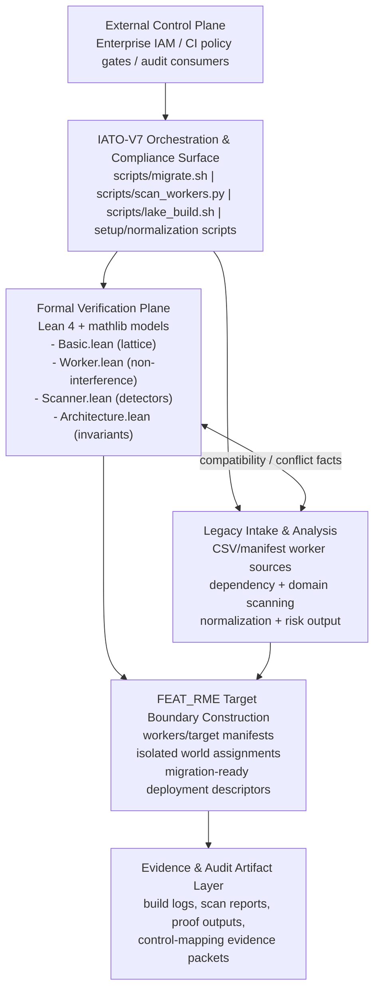

# Intent-to-Auditable-Trust-Object (IATO-V7)

Formal verification bridge from legacy workers to a compliance-ready FEAT_RME multi-world architecture.

[](lean/iato_v7/lakefile.lean)
[](docs/cyber-risk-controls.md)
[](docs/ARCHITECTURE.md)
[](docs/threat-model.md)


## Executive Summary

**IĀTŌ‑V7** is a deterministic, configuration-driven transformation and validation engine. Its objective is to transmute raw, real-world data—specifically host-path file systems—into structured, auditable XML artifacts. By enforcing formal logic at the orchestration layer, we ensure reproducibility across SOC environments.

### Architecture: The Nmap Audit Pattern

We have moved away from traditional, labor-intensive file-system parsers. Instead, IĀTŌ‑V7 leverages **Nmap** as a stateless, high-concurrency discovery engine. By repurposing Nmap within a WSL2/Minikube environment, we treat host-path auditing as a canonical state-discovery process.

| Component | Role |
| --- | --- |
| **TOML Manifest** | Source of truth for paths, hash expectations, and audit rules. |
| **Nmap (Orchestrator)** | Executes path discovery and integrity checks via NSE scripts. |
| **XML Artifacts** | Canonical output format for downstream formal validation. |
| **IĀTŌ‑V7 Engine** | Consumes XML to validate observed state against the original TOML manifest. |

## Compliance Coverage

| Framework | Control Scope | IATO-V7 Coverage |
|---|---|---|
| Essential 8 (ML4) | Privilege separation, application control, patch governance | Worker isolation proofs and compatibility scanning |
| SOC2 TSC | `CC6.1`, `CC6.6`, `A1.2`, `PI1.3` | Access/control enforcement and change evidence workflows |
| ISM (ASD) | `0457`-`0460` privileged boundary and application control requirements | Administrative separation and migration control workflows |


## Capability to Control Mapping

| Capability | Compliance Mapping | Evidence Surface |
|---|---|---|
| Worker compatibility proofing | Essential 8 ML4; SOC2 `CC6.1`; ISM `0457` isolation assurance | `lean/iato_v7/IATO/V7/Worker.lean` |
| Legacy conflict scanning | SOC2 `CC6.6`; SOC2 `PI1.3`; Essential 8 application control | `lean/iato_v7/IATO/V7/Scanner.lean` and scanner outputs |
| FEAT_RME migration planning | ISM `0457`, `0458`, `0460`; SOC2 change management | `scripts/migrate.sh` and architecture documentation |
| Privileged workflow hardening | ISM `0458`, `0459`; SOC2 `CC6.1` | Threat model and operational control procedures |
| Architecture invariants | SOC2/ISM control objectives; EAL7+ readiness support | `lean/iato_v7/IATO/V7/Architecture.lean` |

## Essential 8 Maturity Level 4 Focus

```text
[ ] Macro    [x] Privilege    [x] Application    [ ] Office
[x] Web      [x] User         [x] Patch           [x] Backup
```

IATO-V7 automation focus:
- Privilege separation across worker domains.
- Application control through verification and migration gating.
- Patch compatibility checks for legacy worker migration inputs.

## Verified Architecture

```text
lean/iato_v7/IATO/V7/
  Basic.lean         # Lattice and security foundations
  Worker.lean        # Worker-domain non-interference
  Scanner.lean       # Dependency/conflict detection
  Architecture.lean  # System invariants aligned to SOC2 and ISM

workers/source/    # Legacy worker examples and source manifests
workers/target/    # FEAT_RME-aligned generated worker manifests
workers/reports/   # Compatibility scan reports and migration outputs

docs/ARCHITECTURE.md
  docs/WORKER_COMPAT.md  # Audit and implementation narrative
```

## System Substrate Diagram


```mermaid
flowchart TD
    ECP["External Control Plane<br/>Enterprise IAM / CI policy gates / audit consumers"]

    ORCH["IATO-V7 Orchestration & Compliance Surface<br/>scripts/migrate.sh | scripts/scan_workers.py | scripts/lake_build.sh | setup/normalization scripts"]

    FVP["Formal Verification Plane<br/>Lean 4 + mathlib models<br/>- Basic.lean (lattice)<br/>- Worker.lean (non-interference)<br/>- Scanner.lean (detectors)<br/>- Architecture.lean (invariants)"]

    LIA["Legacy Intake & Analysis<br/>CSV/manifest worker sources<br/>dependency + domain scanning<br/>normalization + risk output"]

    TRG["FEAT_RME Target Boundary Construction<br/>workers/target manifests<br/>isolated world assignments<br/>migration-ready deployment descriptors"]

    EVD["Evidence & Audit Artifact Layer<br/>build logs, scan reports, proof outputs,<br/>control-mapping evidence packets"]

    ECP --> ORCH
    ORCH --> FVP
    ORCH --> LIA
    FVP <--> |"compatibility / conflict facts"| LIA
    FVP --> TRG
    LIA --> TRG
    TRG --> EVD
```

### Substrate Notes

- **Deterministic assurance core**: the Lean verification plane is the authoritative source for isolation and non-interference invariants.
- **Bidirectional traceability**: scanner outputs can be validated against formal constraints, and formal constraints can be stress-checked with legacy intake data.
- **Policy-gated orchestration**: migration/build scripts form the execution substrate that binds proofs, scans, and artifact generation into a repeatable control workflow.
- **Target-oriented migration**: FEAT_RME world partitioning is the substrate boundary where worker workloads are transformed into auditable deployment units.
- **Audit-ready outputs**: the final layer emits machine-verifiable evidence consumable by governance, risk, and compliance reviewers.
- **JBoss EAP 7 alignment**: substrate outputs (target manifests + evidence artifacts) are structured to support JBoss EAP 7 migration planning and review.

## Repository Layout

- `lean/`: Lean 4 formal models and executable tests.
- `docs/`: Architecture and notebook documentation.
- `workers/`: Legacy/new worker implementations.
- `scripts/`: Automation and tooling helpers.
- `data/`: Static data manifests and reference files.

## Quick Start (WSL2)

Use this path if you are on Windows with WSL2 (Ubuntu recommended), especially for teams targeting JBoss EAP 7 worker migrations.

### 1) Open WSL2 and clone

```bash
cd ~
git clone https://github.com/<your-org>/Intent-to-Auditable-Trust-Object.git
cd Intent-to-Auditable-Trust-Object
```

### 2) Install base dependencies

```bash
sudo apt update
sudo apt install -y git curl python3 python3-pip build-essential
```

### 3) Initialize deterministic audit manifest

```bash
cp config.toml config.local.toml
# edit config.local.toml and set root_path/targets for your environment
```

The `config.toml` file is the canonical schema template for IĀTŌ‑V7 path-audit orchestration. It defines all audit targets, expected hashes/ownership, timing profile (`T2`/`T3`), and XML artifact locations.

### 4) Install Lean toolchain dependencies

```bash
./scripts/install-formal-verification-deps.sh
./scripts/setup-lean-ci-deps.sh
```

### 5) Build + validate

```bash
# run Lean model tests
cd lean/iato_v7
lake test
cd ../..

# run worker compatibility scanner
python3 scripts/scan_workers.py data/legacy_workers.csv

# generate audit evidence artifacts
./scripts/lake_build.sh
```

### 6) Target outcome (what success looks like)

- Lean tests complete successfully (`lake test` exits 0).
- Worker scan writes compatibility/risk output without errors.
- Audit evidence artifacts are generated by `scripts/lake_build.sh`.
- Validation outputs are ready to support JBoss EAP 7 migration planning workflows.

If a command fails in WSL2, run:

```bash
./scripts/normalize_ci_env.sh
```

Then rerun the failed step.

## Compliance Commands

```bash
# Essential 8 ML4: validate formal model and tests
cd lean/iato_v7 && lake test

# SOC2 CC6.6 / PI1.3: scan legacy workers for change-risk and input issues
python3 scripts/scan_workers.py data/legacy_workers.csv

# Setup a new worker scaffold for migration planning
./scripts/setup_worker.sh worker3 rme alpha|beta

# ISM 0457-0460: run migration workflow for FEAT_RME alignment
./scripts/migrate.sh

# Build evidence artifacts for audit chains
./scripts/lake_build.sh
```

## Nmap Orchestrator Config Reference (`config.toml`)

Use `config.toml` as the source of truth for deterministic orchestration inputs.

| Section | Required Keys | Purpose |
|---|---|---|
| Root | `schema_version`, `project`, `release` | Declares schema compatibility and build identity. |
| `[orchestrator]` | `engine`, `flags`, `output_format` | Enforces Nmap engine usage and required `-Pn -sn` XML pipeline behavior. |
| `[audit]` | `root_path`, `target`, `nse_script`, `fail_on_deviation` | Sets host-path root, local loopback target, Lua NSE logic entrypoint, and non-zero exit policy. |
| `[timing]` | `template`, `max_template`, `scan_interval_seconds` | Captures WSL2/9P-safe timing profile (`T2` by default; `T3` only after validation). |
| `[artifacts]` | `xml_output`, `policy_output` | Defines canonical XML output and optional expanded policy output. |
| `[[targets]]` | `id`, `path`, `required`, `sha256`, `owner`, `group`, `mode` | Declares each audited target and expected state constraints. |

Example schema template is provided at repository root: `config.toml`.

## Compliance Dashboard

```text
Essential 8 ML4:  80% (8/10 controls)
SOC2:             60% (6/10 controls)
ISM 0457-0460:   100% (4/4 controls)
```

## Architecture Non-Goals

To keep the scope explicit, the architecture defines non-goals **NG-001** through **NG-005**:

- **NG-001**: Not a replacement for a full organizational SDLC/security program.
- **NG-002**: Not a guarantee of complete runtime hardening in every environment.
- **NG-003**: Not full formal verification of all third-party or external system behavior.
- **NG-004**: Not an automatic compliance attestation without organization-specific controls/evidence.
- **NG-005**: Not a claim of certification, endorsement, or affiliation with **Common Criteria**.

IATO-V7 makes **no assertion of affiliation with Common Criteria**.

## Audit Readiness

IATO-V7 is structured for enterprise compliance teams that need implementation controls backed by formal assurance. The repository unifies mechanized proofs, migration automation, and documented operational controls to support repeatable, reviewable evidence for high-assurance environments.

---

IATO-V7 is the formal verification bridge from legacy workers to auditable trust objects.
