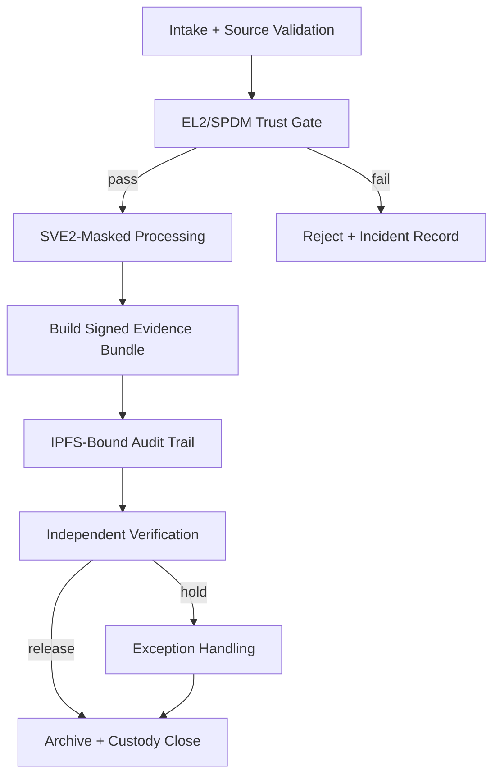

# TS/SCI Batch Lifecycle Procedure (IĀTŌ-V7)

## Purpose
Define a repeatable, auditable, and compliance-oriented procedure for handling TS/SCI batches in IĀTŌ-V7, with signed evidence at each control point and privacy-preserving auditability.

## Scope
This procedure applies to ingestion, processing, attestation, evidence generation, verification, archival, and destruction of TS/SCI data batches represented as auditable trust objects.

## References
- Repository TS/SCI docs index: `docs/ts_sci_batches/README.md`
- NIST SP 800-53 Rev. 5 (AC, AU, SC, SI families)
- OWASP ASVS Level 3+
- SOC 2 (Security, Availability, Confidentiality)
- Common Criteria (EAL4+ assurance practices)
- PKCS#11 Cryptographic Token Interface Base Specification
- SPDM specification (DMTF) for platform attestation
- RFC 3339 timestamps, SHA-256/SHA-512 hashing guidance

## Security Invariants
1. **Zero persistent secrets:** plaintext secret material is never written to persistent storage.
2. **Hardware-enforced trust:** EL2 controls, SMMU DMA policy, and attestation gates must pass before processing.
3. **Offline-verifiable logs:** all critical events are emitted as NDJSON with detached signatures and hash chaining.
4. **Replay resistance:** nonces and monotonic counters are required for intake and release operations.
5. **Side-channel minimization:** use SVE2-masked vector operations and constant-time cryptographic paths.
6. **Chain of custody:** each custody transition is signer-bound with timestamp and role assertion.

## Responsibilities
| Role | Responsibility |
|---|---|
| Intake Officer | Creates batch record, validates source authority, initiates custody chain |
| EL2 Platform Operator | Verifies attestation state, hypervisor policy, and SMMU enforcement |
| Processing Operator | Executes approved transformations and masking pipeline |
| Crypto Custodian | Manages PKCS#11 key usage policy and signing ceremonies |
| Audit Officer | Performs independent verification and exception review |
| Destruction Officer | Executes and records destruction/archival disposition |

## Prerequisites
- Active mission authorization for TS/SCI compartment handling.
- EL2-validated credential for all handlers.
- PKCS#11 token/HSM reachable and policy-compliant.
- SPDM attestation endpoint reachable and current.
- Evidence output location configured for immutable retention and IPFS publication.

## Required Batch Metadata Schema
```json
{
  "batch_id": "uuid-v4",
  "classification_level": "//TS//SCI//NOFORN//ORCON",
  "sensitivity_compartment": ["SCI-ALPHA", "SCI-BRAVO"],
  "creation_timestamp": "2026-02-28T12:34:56Z",
  "handler_identity": {
    "subject": "operator@mission.local",
    "credential_type": "EL2-validated credential",
    "credential_serial": "cred-01A92"
  },
  "integrity_hash": "sha256:...",
  "signature": {
    "algorithm": "RSA-PSS-SHA256",
    "pkcs11_key_label": "iato-batch-signing-key",
    "signature_b64": "..."
  },
  "ipfs_cid": "bafy..."
}
```

## Procedure

### 1. Intake and Registration
1. Receive batch from authorized source over approved channel.
2. Validate source signature and timestamp window.
3. Assign `batch_id` (UUIDv4) and create initial metadata envelope.
4. Record custody entry (`from`, `to`, `purpose`, `time`, `nonce`).
5. Emit `intake_event.ndjson` and sign it with PKCS#11 key.

**Evidence Produced**
- `evidence/intake/intake_event.ndjson`
- `evidence/intake/intake_event.sig`
- `evidence/intake/source_verification.json`

### 2. Platform Trust Gate (EL2 + SPDM)
1. Query SPDM evidence for platform measurements and freshness.
2. Verify EL2 policy version and anti-rollback state.
3. Validate SMMU DMA policy table digest.
4. Reject processing if any trust gate fails.

**Evidence Produced**
- `evidence/attestation/spdm_transcript.json`
- `evidence/attestation/el2_policy_digest.json`
- `evidence/attestation/smmu_policy_digest.json`

### 3. Secure Processing and Masking
1. Load sensitive fields into SVE2-masked vectors.
2. Execute approved transforms using constant-time operations.
3. Prohibit debug dumps, swap, and persistent plaintext staging.
4. Generate deterministic transformation manifest.

**Security Considerations**
- Disable nonessential telemetry during sensitive compute windows.
- Enforce CPU pinning and fixed-frequency mode where supported to reduce leakage variance.

**Evidence Produced**
- `evidence/processing/transform_manifest.json`
- `evidence/processing/runtime_policy_snapshot.json`

### 4. Signed Evidence Bundle Construction
1. Canonicalize all evidence documents.
2. Compute Merkle root over ordered evidence list.
3. Sign bundle manifest via PKCS#11.
4. Publish immutable copy and capture `ipfs_cid`.

**Evidence Produced**
- `evidence/bundle/manifest.json`
- `evidence/bundle/manifest.sig`
- `evidence/bundle/merkle_proof.json`
- `evidence/bundle/ipfs_publish.json`

### 5. Verification and Release Decision
1. Independent verifier checks signatures, hash chain, Merkle proof, timestamps, and nonce uniqueness.
2. Validate classification markings and compartment tags.
3. Issue release/hold decision with signer identity.

**Evidence Produced**
- `evidence/verification/verification_report.json`
- `evidence/verification/release_decision.sig`

### 6. Archival or Destruction
1. If retention required, archive signed bundle with immutable pointer set.
2. If destruction authorized, execute destruction protocol and dual-control witness signoff.
3. Close custody ledger for batch.

**Evidence Produced**
- `evidence/disposition/archive_record.json` or `evidence/disposition/destruction_record.json`
- `evidence/disposition/witness_attestation.sig`

## Verification Checks
| Check | Method | Pass Criteria |
|---|---|---|
| Signature validity | PKCS#11 verify + cert chain check | All signatures valid and unexpired |
| Replay protection | Nonce/counter uniqueness query | No duplicate nonce/counter in retention window |
| Timestamp integrity | RFC 3339 parse + trusted time source bounds | Events in approved skew window |
| Attestation freshness | SPDM challenge/response age check | Within policy TTL |
| Evidence completeness | Required artifact list comparison | 100% required artifacts present |
| Classification integrity | Marking parser | TS/SCI labels complete and consistent |

## Control Mapping (Sample)
| Control Objective | Mapping |
|---|---|
| Least privilege for handlers | NIST 800-53 AC-6 |
| Audit log integrity and tamper resistance | NIST 800-53 AU-9 |
| Cryptographic protection at rest/in transit | NIST 800-53 SC-28 |
| Secure key management operations | NIST 800-53 SC-12 |
| Boundary and virtualization hardening | Common Criteria / virtualization PP alignment |

## Exceptions / Deviation Handling
1. Record deviation with reason code and approving authority.
2. Quarantine affected batch state.
3. Trigger independent security review before resuming flow.
4. Append deviation evidence to signed evidence bundle.

## Mermaid Flow Diagram


## Destruction / Archival Requirements
- Retain signed evidence bundle per mission retention schedule.
- Preserve verification tool versions required for future offline validation.
- For destruction, document method, operator pair, timestamp, and final custody closure signature.

## Example NDJSON Event
```json
{"event":"batch_intake","batch_id":"2f6c72a4-3f1c-437a-a43e-d0478f3ab2da","classification_level":"//TS//SCI//NOFORN//ORCON","handler_identity":"operator@mission.local","nonce":"c7c53d4f1f104ec792af","timestamp":"2026-02-28T12:34:56Z","integrity_hash":"sha256:...","ipfs_cid":"bafy..."}
```
